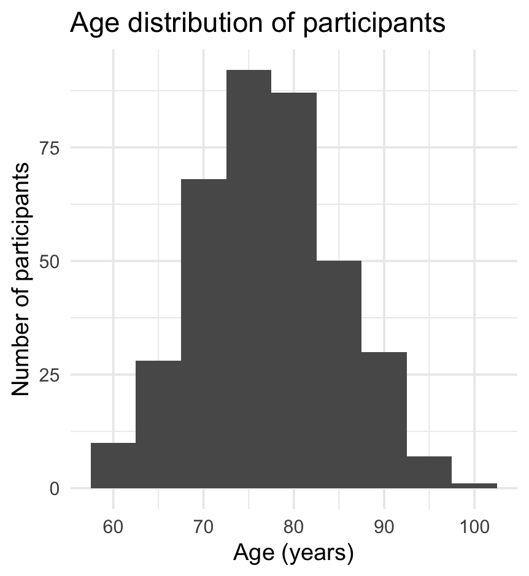
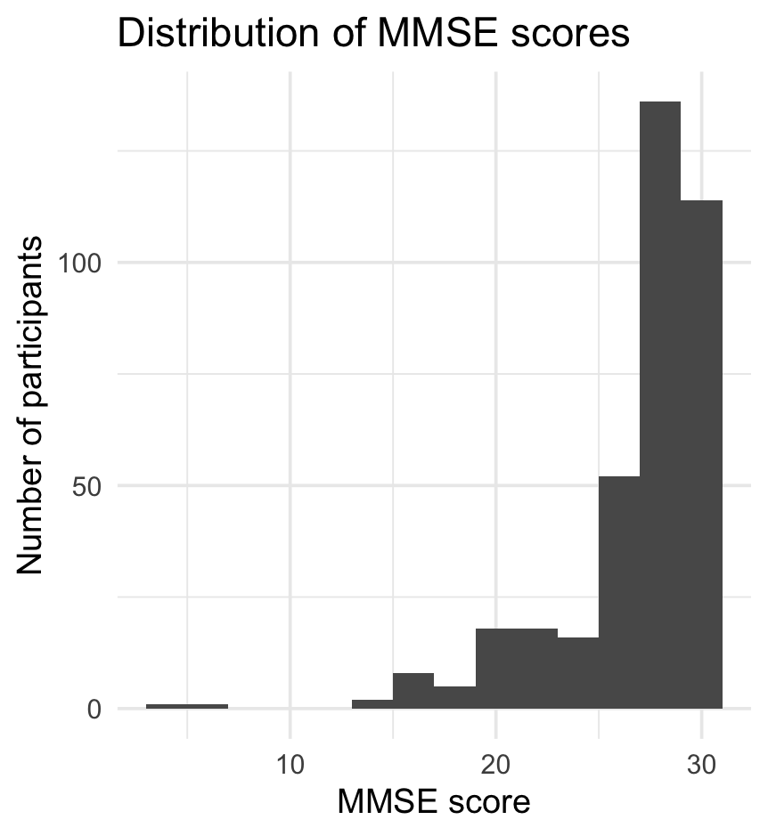
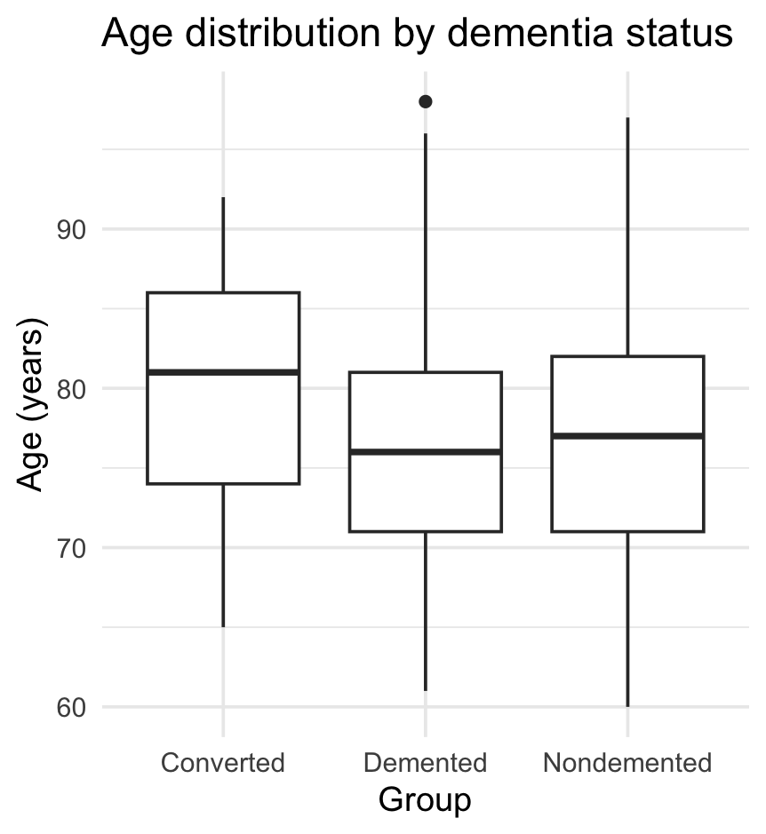
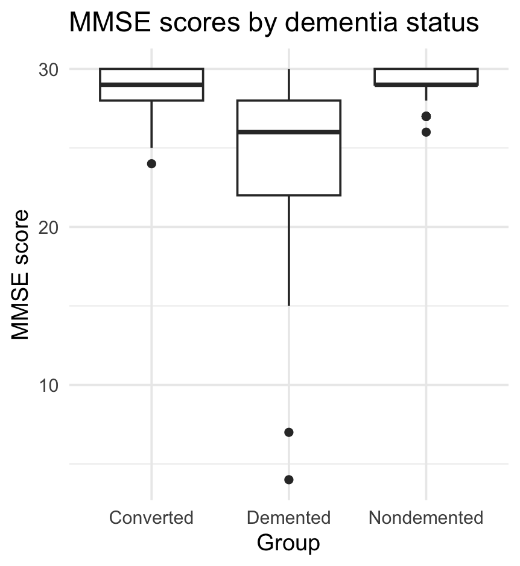
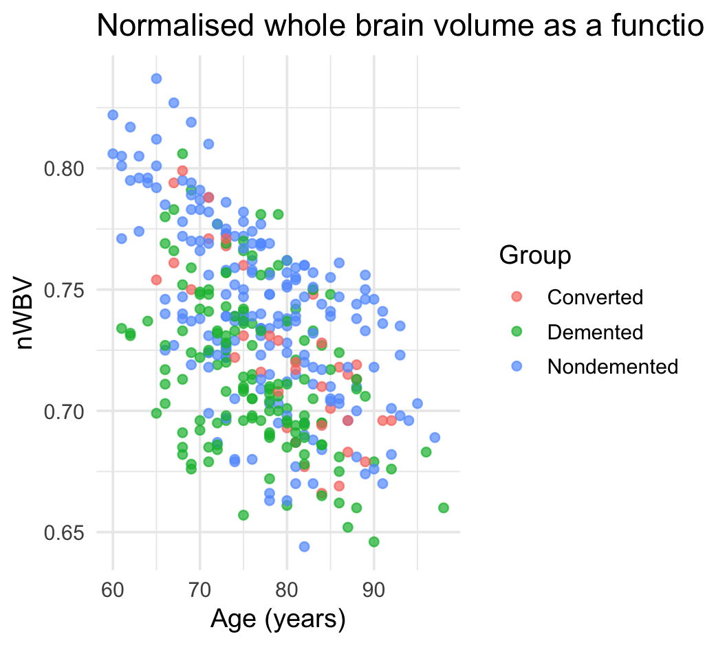

🧠 Dementia Kaggle Project
Exploratory Cognitive & Neuroimaging Analysis using R

     

📘 Overview

This repository contains a comprehensive exploratory data analysis (EDA) of a dementia dataset from Kaggle, integrating:

Clinical measures

Cognitive assessments (MMSE, CDR)

MRI-derived structural brain features (eTIV, nWBV)

The analysis is implemented in R Markdown, producing a structured PDF report with academic-level interpretation.

🧬 Dataset Description

The dataset includes 373 observations and 15 variables, comprising demographic, behavioural, and neuroimaging attributes.

Type Variables
Demographic Age, Gender, SES, EDUC
Cognitive MMSE, CDR
MRI-derived eTIV, nWBV, ASF
Longitudinal Subject ID, MRI ID, Visit, MR Delay

This dataset allows exploration of structural atrophy, cognitive impairment, and risk factors for dementia.

🎯 Project Objectives

✔️ Characterise the dataset using descriptive statistics
✔️ Visualise cognitive and neuroimaging distributions
✔️ Compare demented vs nondemented groups
✔️ Examine correlations between brain volume, age, and cognition
✔️ Fit an exploratory logistic regression (Age + MMSE + nWBV → Dementia)

📂 Repository Structure
📁 Dementia_Kaggle
│
├── 📄 dementia_dataset.csv # Raw dataset
├── 📄 kaggle_dementia_dataset.Rmd # Full analysis (EDA + modelling)
├── 📄 kaggle_dementia_dataset.pdf # Knitted report (optional)
├── 📄 README.md # Project documentation
└── 📁 figures/ # (Optional) Exported images for README

📊 Key Figures

If you add a /figures folder with exported PNGs, GitHub will render the images here.

1️⃣ Age Distribution

2️⃣ MMSE Distribution

3️⃣ Dementia Group Counts

4️⃣ nWBV Distribution (Brain Volume)

5️⃣ Age by Group

6️⃣ MMSE by Group

7️⃣ nWBV by Group

8️⃣ Correlation Matrix

9️⃣ Scatterplots

MMSE vs Age

nWBV vs Age

🧪 Logistic Regression Model

The exploratory multivariable model evaluates whether Age, MMSE, and nWBV predict dementia status.

Outcome: Dementia (binary)
Predictors: Age + MMSE + nWBV
Method: Logistic Regression (glm, family = binomial)

Interpretation focuses on effect direction, not clinical diagnosis.

▶️ How to Run the Analysis

Install R and RStudio

Install dependencies:

install.packages("tidyverse")

Open kaggle_dementia_dataset.Rmd in RStudio

Click Knit → Knit to PDF

A full academic report will be generated.

📝 Key Insights

Demented participants show lower MMSE scores

nWBV is significantly reduced in demented individuals, reflecting brain atrophy

Age negatively correlates with both cognition and brain volume

Logistic regression suggests:

↑ Age → ↑ probability of dementia

↓ MMSE → ↑ probability of dementia

↓ nWBV → ↑ probability of dementia

These patterns are consistent with established dementia research.

⚠️ Limitations

Cross-sectional analysis of originally longitudinal data

Illustrative modelling (not clinically validated)

Missing SES/MMSE data may bias interpretation

🔭 Future Directions

Longitudinal modelling of cognitive decline

Machine learning models (random forest, XGBoost, SVM)

Inclusion of socioeconomic factors in multivariable prediction

Additional MRI-derived biomarkers

🤝 Contributions

Pull requests, discussions, and suggestions are welcome!

📜 License

This project is released under the MIT License.
